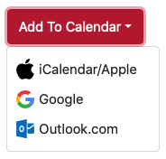

# Calvin
  

Smooth sailing for adding calendar event links in a [Bootstrap](https://getbootstrap.com) style button or dropdown

## Usage
1. **Install** Calvin with [`yarn`](https://yarnpkg.com) or [`npm`](https://www.npmjs.com)  
2. **Import** Calvin: `import calvin from 'calvin'`  
3. **Init** Calvin: `calvin.init()`
4. **Include** an element or elements on the page with the class of `calvin` passing the event info through the following data attributes:
    * `data-title`: Event Title  
    * `data-description` _(optional)_: Event Description  
    * `data-start`: Start dateTime of Event
    * `data-end`: End dateTime of Event
    * `data-location`: Event location
    * `data-timezone` _(optional)_: Timezone of the Event
    * `data-filename` _(optional)_: Name for the event .ics file
5. Celebrate!  


## Options
The Calvin init method can take an options object for the following customizations:

**linkTypes**  
Calvin can create links for different calendar types. `linkTypes` takes and array of calendar types. These links can be reordered or removed. If there is only one item in this array, then a button will be generated. If is more than one item then they will be but into a dropdown menu.

Default: `['icalendar', 'google', 'outlook', 'outlookcom', 'yahoo']`

**buttonContent**
The main Calivin.js button content can be customized with the `buttonContent` option.

Default: `Add To Calendar`

**bootstrapButtonColor**  
Calvin relies on [Bootstrap](https://getbootstrap.com) and the button color can be customized with any of the [Bootstrap Colors](https://getbootstrap.com/docs/4.3/utilities/colors/)

Default: `primary`

**includeIcons**
Calvin can include icons for each of the links types in the dropdown. These will be included by default.

Default: `true`

**parentClass**  
Calvin looks for elements with a certain class. This defaults to 'calvin', but can be set to any other class with the `parentClass` property.

Default: `calvin`

## Example
```
calvin.init({
  bootstrapButtonColor: 'danger',
  linkTypes: ['icalendar', 'google', 'outlookcom']
});
```

```
<div
  class="calvin"
  data-title="Event Title"
  data-description="Event Description"
  data-start="2020-11-01T09:00:00.000-07:00"
  data-end="2020-11-01T10:01:00.000-07:00"
  data-location="123 Fake St"
  data-timezone="America/Los_Angeles"
  data-filename="filename">
</div>
```


